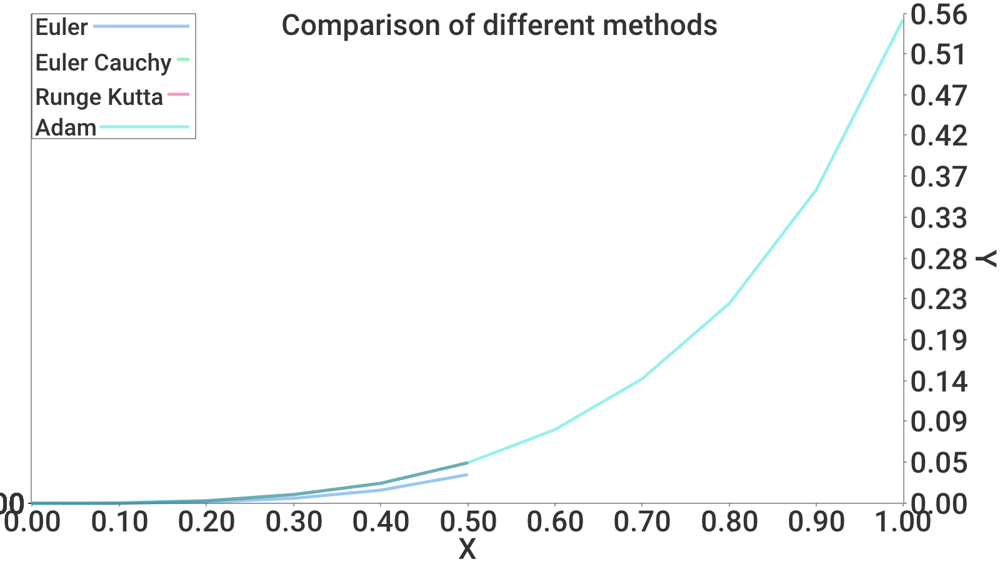

# Assignment 3. Numerical solutions

> [!NOTE]
> Solve the ODE numerically using the four given methods (Lecture
4, slides 13, 17, 24, 28)

## Plot


## Euler Method

```
k | x   |      y       | y_true        | eps           | dy
0 | 0.0 | 0.000000000  | 0.000000000   | 0.000000000   | 0.000000000
1 | 0.1 | 0.000000000  | 0.000334672   | 0.000334672   | 0.010067046
2 | 0.2 | 0.001006705  | 0.002710036   | 0.001703331   | 0.041091358
3 | 0.3 | 0.005115840  | 0.009336250   | 0.004220409   | 0.095688915
4 | 0.4 | 0.014684732  | 0.022793219   | 0.008108487   | 0.178754106
5 | 0.5 | 0.032560143  | 0.046302490   | 0.013742347   | 0.298446410
----------------------------------------------------------------------
```

## EulerCauchyMethod
```
k | x   |      y       | y_hats       |y_true         | eps         | dy
0 | 0.0 | 0.000000000  | 0.000000000  | 0.000000000   | 0.000000000 | 0.000000000   
1 | 0.1 | 0.000000000  | 0.000000000  | 0.000334672   | 0.000334672 | 0.010067046   
2 | 0.2 | 0.002530270  | 0.001341377  | 0.002710036   | 0.000179766 | 0.041091358   
3 | 0.3 | 0.009291738  | 0.006819171  | 0.009336250   | 0.000044512 | 0.095688915   
4 | 0.4 | 0.022850260  | 0.018905141  | 0.022793219   | 0.000057041 | 0.178754106   
5 | 0.5 | 0.046404093  | 0.040668629  | 0.046302490   | 0.000101603 | 0.298446410
----------------------------------------------------------------------
```
## RungeKuttaMethod
```
k | x   |      y       | y_true        | eps           | dy
0 | 0.0 | 0.000000000  | 0.000000000   | 0.000000000   | 0.000000000
1 | 0.1 | 0.000000000  | 0.000334672   | 0.000334672   | 0.010067046
2 | 0.2 | 0.002709964  | 0.002710036   | 0.000000072   | 0.041091358
3 | 0.3 | 0.009336205  | 0.009336250   | 0.000000045   | 0.095688915
4 | 0.4 | 0.022793219  | 0.022793219   | 0.000000000   | 0.178754106
5 | 0.5 | 0.046302556  | 0.046302490   | 0.000000067   | 0.298446410
----------------------------------------------------------------------
```
## MultistepAdamsMethod
```
k | x   |      y       | y_true        | eps           | dy
0 | 0.0 | 0.000000000  | 0.000000000   | 0.000000000   | 0.000000000
1 | 0.1 | 0.000334672  | 0.000334672   | 0.000000000   | 0.010067046
2 | 0.2 | 0.002710036  | 0.002710036   | 0.000000000   | 0.041091358
3 | 0.3 | 0.009336250  | 0.009336250   | 0.000000000   | 0.095688915
4 | 0.4 | 0.022715337  | 0.022793219   | 0.000077882   | 0.178754106
5 | 0.5 | 0.046113698  | 0.046302490   | 0.000188792   | 0.298446410
6 | 0.6 | 0.083775064  | 0.084136808   | 0.000361744   | 0.468043173
7 | 0.7 | 0.141636472  | 0.142288380   | 0.000651908   | 0.709449716
8 | 0.8 | 0.228465295  | 0.229638557   | 0.001173262   | 1.060155558
9 | 0.9 | 0.357976137  | 0.360158218   | 0.002182080   | 1.587998733
10 | 1.0 | 0.553092818  | 0.557407725   | 0.004314907   | 2.425518821
----------------------------------------------------------------------
```
