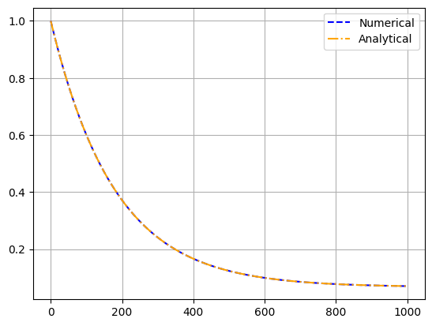

# Assignment 5. Group modeling task

## Replication article results
```python
from scipy.integrate import odeint
import numpy as np
import matplotlib.pyplot as plt
import pandas as pd

# ODE for survival
def surv_frac(s, t, k, si):
    dSdt = -k*(s - si)
    return dSdt


# Set initial conditions and time grid
initial_surv = 1.0 # S(0) = 1
time = np.linspace(0, 280, 1000) # Time from 0 to 280 weeks
# Constants from the article
# As Taver = 0.960 years = 50.09143 weeks = 1/k
k = 1 / 50.09143
si = 0.0665

# Solve the ODE numerically
solution_num = odeint(
    surv_frac,
    initial_surv,
    time,
    args=(k, si)
)

# Analytical solution from the article
solution_ana = si + (1 - si) * np.exp(-k*time)

# Plotting
plt.plot(solution_num, "--", color="blue", label="Numerical")
plt.plot(solution_ana, "-.", color="orange", label="Analytical")
plt.grid()
plt.legend()
```
> The original data for least-squares fitting could not be found but as the task of such fitting is not
the main point of this work, constants from the article ($k$ and $S_i$) were taken for illustrative
measures. The code produces the following result:
> 
> This is exactly the trend observed in the article. Additionally, numerical and analytical solution
yielded the same results.